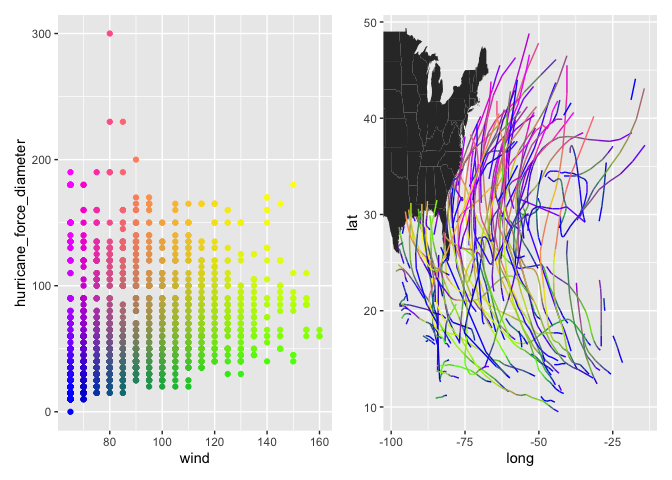

<!-- README.md is generated from README.Rmd. Please edit that file -->

# colors3d

<!-- badges: start -->
<!-- badges: end -->

This R package provides functions to help generate two-dimensional and
three-dimensional color gradient legends.

The three main functions, `colors3d`, `colors2d`, and `colorwheel2d`
generate a color for each row of a user-supplied data set with 2-3
columns. These can then be used for plotting in various ways.

## Installation

You can install colors3d from [GitHub](https://github.com/) with
`devtools::install_github("matthewkling/colors3d")`

## Examples

Here’s a simple application of the three color mapping functions. I’m a
tidyverse type so I use that here, but this would all work in base R as
well:

``` r
library(colors3d)
library(tidyverse)
#> ── Attaching packages ─────────────────────────────────────── tidyverse 1.3.2 ──
#> ✔ ggplot2 3.3.6     ✔ purrr   1.0.1
#> ✔ tibble  3.1.8     ✔ dplyr   1.1.0
#> ✔ tidyr   1.3.0     ✔ stringr 1.5.0
#> ✔ readr   2.1.2     ✔ forcats 0.5.2
#> ── Conflicts ────────────────────────────────────────── tidyverse_conflicts() ──
#> ✖ dplyr::filter() masks stats::filter()
#> ✖ dplyr::lag()    masks stats::lag()

# simualte a 3D data set
d <- expand_grid(x = 1:20, y = 1:20, z = 1:4)

# define and plot some 2D color mappings
d$colors2d <- colors2d(d[, 1:2])
d$colorwheel2d <- colorwheel2d(d[, 1:2])
d %>%
      gather(mapping, color, colors2d, colorwheel2d) %>%
      ggplot(aes(x, y, fill = color)) +
      facet_wrap(~mapping) +
      geom_raster() +
      scale_fill_identity()
```


``` r

# define and plot a 3D color mapping
d$color3d <- colors3d(d[, 1:3])
#> Loading required package: scales
#> 
#> Attaching package: 'scales'
#> 
#> The following object is masked from 'package:purrr':
#> 
#>     discard
#> 
#> The following object is masked from 'package:readr':
#> 
#>     col_factor
#> 
#> Loading required package: combinat
#> 
#> Attaching package: 'combinat'
#> 
#> The following object is masked from 'package:utils':
#> 
#>     combn
d %>%
      ggplot(aes(x, y, fill = color3d)) +
      facet_wrap(~z, nrow = 1, labeller = label_both) +
      geom_raster() +
      scale_fill_identity()
```

 In a more
realistic application, we often want to create a pair of plots for a
given visualization: a “legend” in which the x and y dimensions match
those used to create the color mapping, and a second plot in which the
colors are then displayed in a different data space. This allows users
to understand relationships among four dimensions of the data (or 5, if
a 3D color mapping is used). Let’s use the `storms` dataset (from dplyr)
as an example, with hurricane windspeed, size, longitude, and latitude
as our variables of interest:

``` r
d <- na.omit(storms)
d$color <- colors2d(select(d, wind, hurricane_force_diameter),
                    xtrans = "rank", ytrans = "rank")

p1 <- ggplot(d, aes(wind, hurricane_force_diameter, color = color)) +
      geom_point() +
      scale_color_identity()
p2 <- ggplot() +
      geom_polygon(data = map_data("state"), 
                   aes(long, lat, group = group)) +
      geom_path(data = d, 
                aes(long, lat, color = color,
                    group = paste(name, year))) +
      scale_color_identity() +
      coord_cartesian(xlim = range(d$long),
                      ylim = range(d$lat))

library(patchwork)
p1 + p2
```


